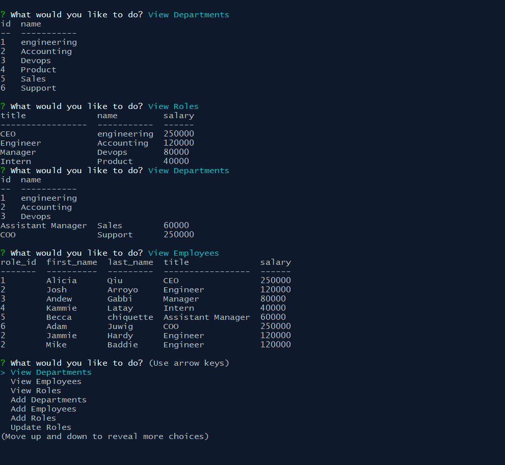

# Employee Tracker


[](https://opensource.org/licensesMIT)


## Description
This is a command line application that is used to view, add, and delete employee data from a connected database. This uses Mysql to store data, uses express.js, inquirer and console.table node packages. Once you run the app you can manually create users through the command line. You can also run seeds.sql file in order to import test data.


## Table of Contents
* [Description](#Description)
* [About](#About)
* [Usage](#Usage)
* [License](#License)


## About 


   

## Usage Instructions

1. Clone the repo
```
git clone git@github.com:Brando2147/Employee-Tracker.git
```
2. Run the command to install dependencies
```
npm install
```    
3. Run the schema.sql file in your Mysql workbench or Mysql command line.

4. You can run the seed.sql file in Mysql if you wish to import test data.

3. Launch the app with the following command:
```
node server.js
```
 

## Contact
Brando2147 - brando2147@gmail.com

Project Link: [https://github.com/Brando2147/Employee-Tracker](https://github.com/Brando2147/Employee-Tracker)
